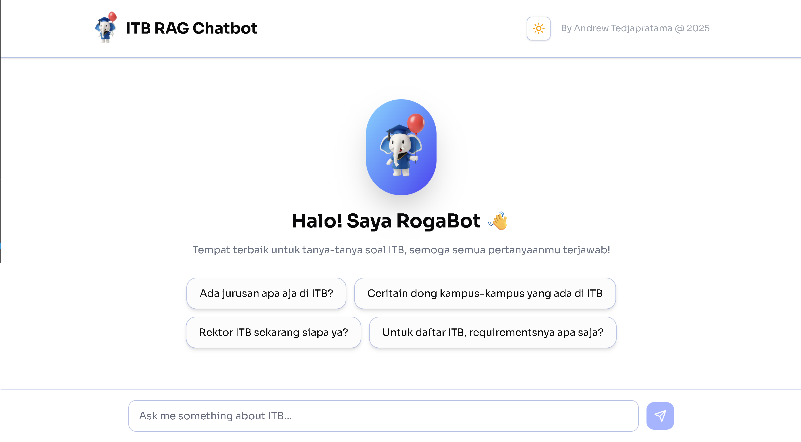
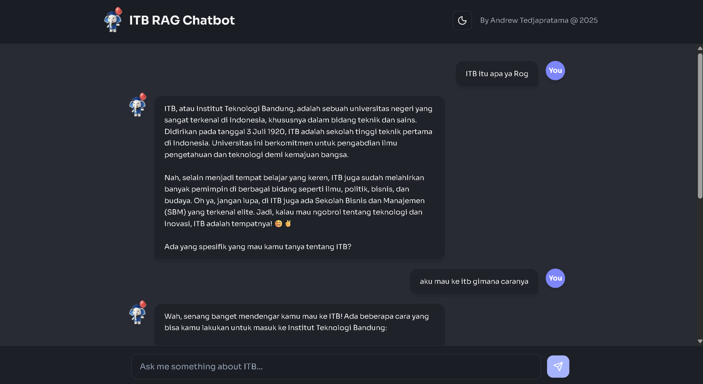

# ITB RAG Chatbot 🐘

A friendly campus assistant **(Roga)** powered by a simple **RAG pipeline** to help ITB students find information **faster** and more **efficiently**.

Designed for **simplicity**, **clarity**, and a **fun experience**.

  
    
  

---
